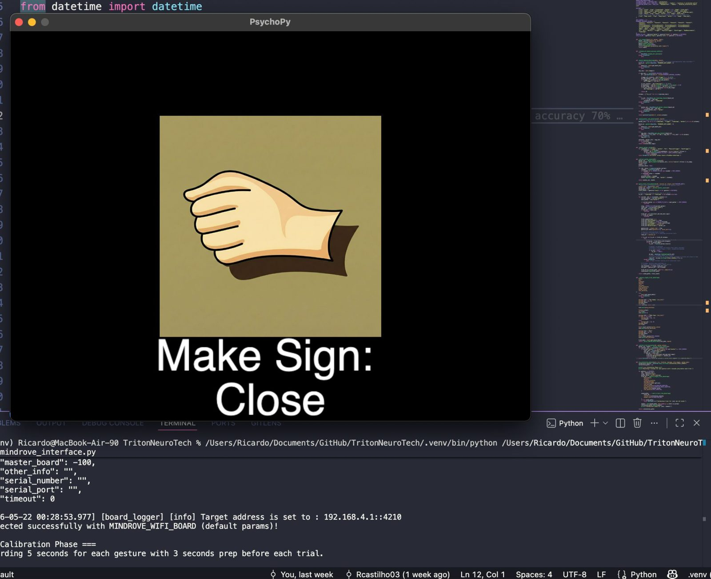
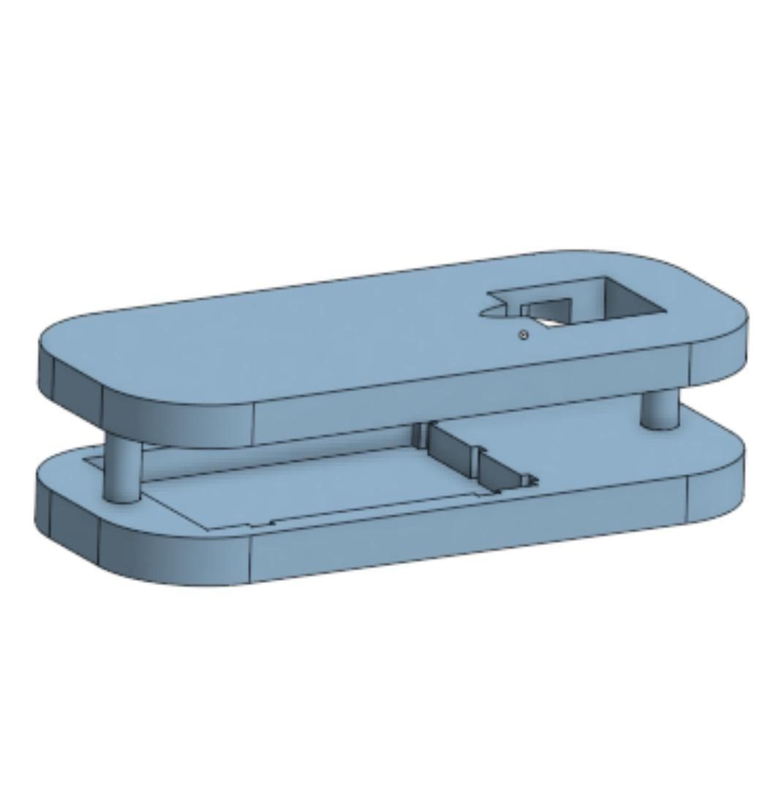

## Goal

Translate hand gestures into speech in real time, supporting communication for ASL learners and educators. The team aimed for a low-cost prototype for schools and inclusive classrooms, in a 3D-printed housing small enough not to get in the way of daily tasks.

## How it works

1. A **MindRove 4-channel EMG band** records forearm muscle activity.
2. The signal is cleaned with a 60 Hz notch filter and a 10–200 Hz Butterworth bandpass, then split into overlapping windows and normalized.
3. RMS and MAV features are extracted per channel, and PCA and UMAP reduce dimensionality so gestures separate better.
4. A classifier predicts the gesture, and an Arduino with a speaker plays the phrase.

## Models

| Model | Setup | Accuracy |
|---|---|---|
| Random forest | Tuned on cleaned EMG features, class-weighted | 70% |
| 2D CNN | EMG snapshots reshaped to 4×13×13, three conv blocks | **78%** |

The team also designed a 3D-printed housing for the electronics.

## Next steps

- Connect the Arduino to the model over Bluetooth
- Use the band's accelerometer and gyroscope to move from simple gestures to real ASL signs
- Map more gestures and improve separation between fingers
- Build an app so the project can be used as an educational tool
