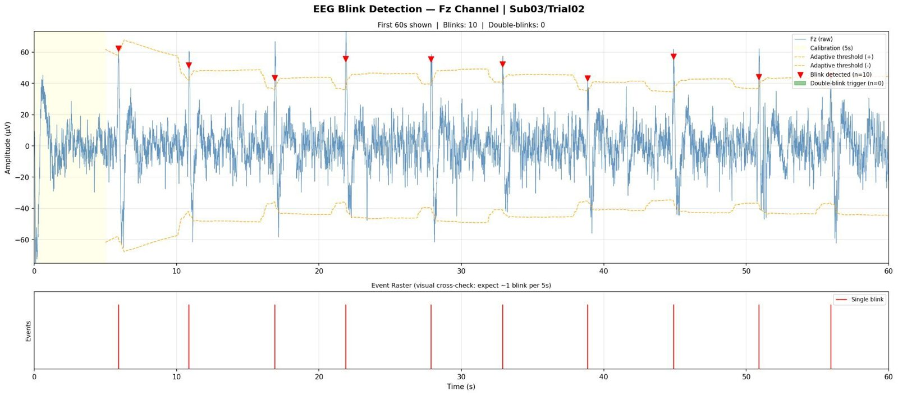
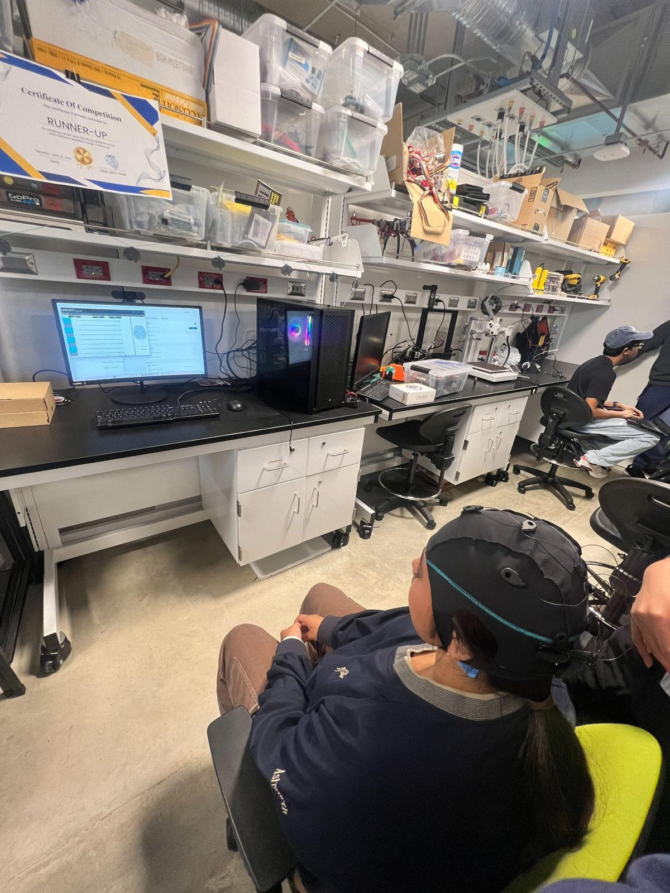

## Goal

A dual-control wheelchair for people with paralysis below the waist. EEG checks for intent to move, and EMG decides the direction: forward, stop, left or right.

## EEG: intent gating

- An 8-channel dry-electrode **Unicorn Hybrid Black** headset streams EEG live.
- The working version uses a **double eye blink** as the "go" signal, detected as two large spikes on the Fz electrode. The online classifier reaches near-100% accuracy on competition data.
- Motor imagery control (imagining a movement) is the next step. Early CSP + LDA models on C3, Cz and C4 reached 50–70%.

## EMG: motion control

A single classifier struggled to answer two questions at once: *what* movement happened, and *which* sensor picked it up. The team split it into a **two-stage cascade**:

1. A motion classifier (SVM and ensemble, trained on UCI data and then the team's own) identifies flex, extend or rest.
2. A small location classifier identifies which electrode patch fired.

This improved accuracy and made the pipeline ready to deploy. Commands are mapped to an **ESP32** for forward, stop and reverse.

## Drive hardware

- Two 12 V batteries
- Motor drivers
- 250 W, 24 V motors
- ESP32 microcontroller

## Next steps

- Four-channel EMG for turning left and right
- Connect the motors to the control board
