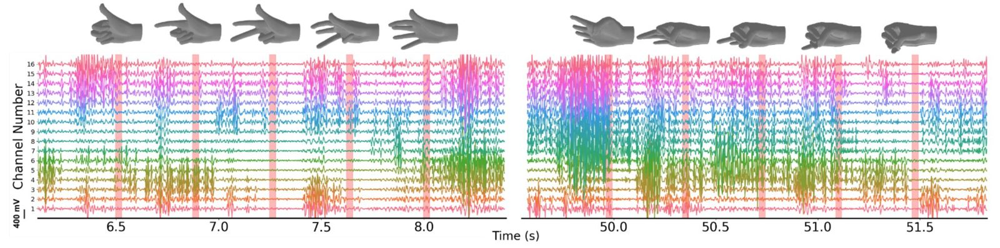

## Goal

Let people play piano without fine finger movement or a physical keyboard, for example after a stroke or spinal cord injury. EMG reads finger positions, and an accelerometer handles hand position and the sustain pedal.

## Approach

- Pretrained a small **Vision Transformer on emg2pose**, a large dataset pairing EMG with hand pose
- Fine-tuned it on the team's own piano EMG recordings
- Treated each moment as multi-label classification of notes and chords

## Results

Trained on single notes, repeated notes, note transitions, simple triads and mixed sequences:

- Single and repeated notes worked best
- Simple triads decoded reasonably well
- Sharps and flats were harder, since the finger differences are subtle
- Complex chords were hardest, because their EMG signals overlap

## Next steps

- Move from 4-channel to 8-channel EMG
- Collect more varied playing data
- Test across sessions and armband placements

This work feeds into this year's [sEMG-based third arm](/projects/semg-third-arm/).
