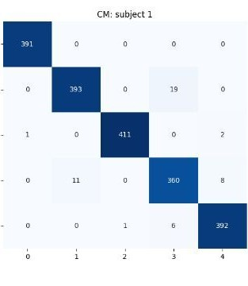

Started in 2024–25 and continued through 2025–26. The team presented it at the California Neurotechnology Conference.

## Results

- **97% gesture accuracy across users**, with predictions in **250 ms**
- Fluid finger movement from spring-tensioned, tendon-driven fingers
- Built for about **$150, roughly 50× cheaper** than a typical prosthetic arm
- A GUI that handles data collection, training and live control in one place

## Hardware

- Open-source finger, palm and forearm parts, reinforced and refined in Fusion
- Fingers pulled by strings wrapped around servo pulleys, with springs for return
- Silicone fingertips for better grip
- A redesigned forearm that houses the electronics and a motor for wrist rotation

## Software

1. A **MindRove armband** reads sEMG from the forearm.
2. Signals go through a 60 Hz notch filter and a 10–200 Hz bandpass, then are split into overlapping, normalized windows.
3. A **BiLSTM** classifies the gesture. The team also tested CNN-LSTM and CNN-GRU models.
4. The GUI, built with Tkinter and the MindRove SDK, sends servo commands to an Arduino over Wi-Fi.

Training data came from the UCI gestures dataset, a Zenodo EMG dataset and the team's own MindRove recordings of five gestures: relax, fist, rock, peace and shaka.

## Next steps

- A second wrist axis with bearings, and side-to-side finger movement
- Transformer and CNN-RNN models for more gestures
- Proportional control for finer movement
- Transfer learning and model quantization to cut calibration time and latency
